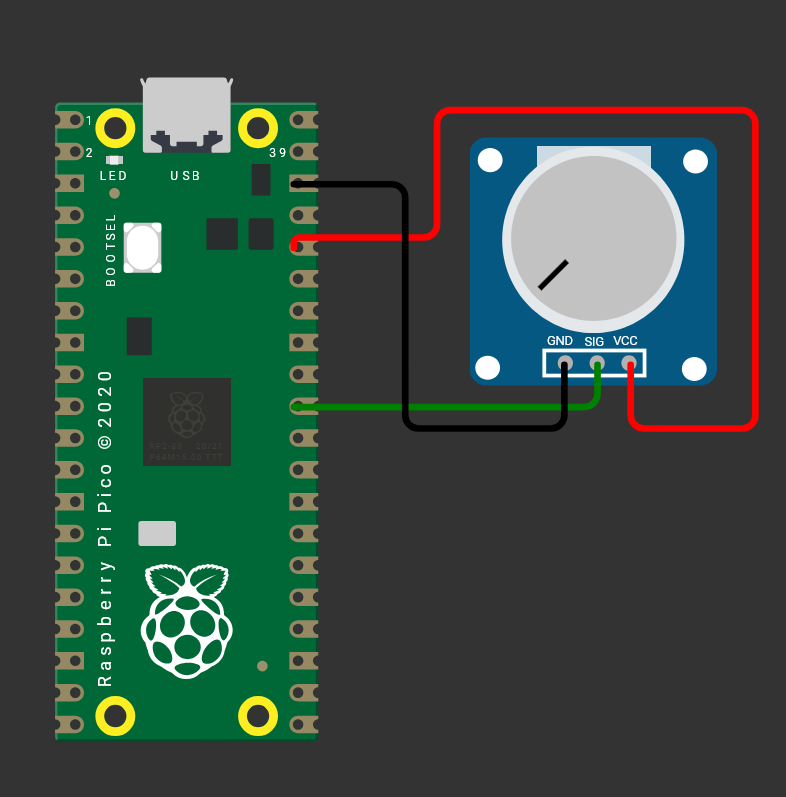
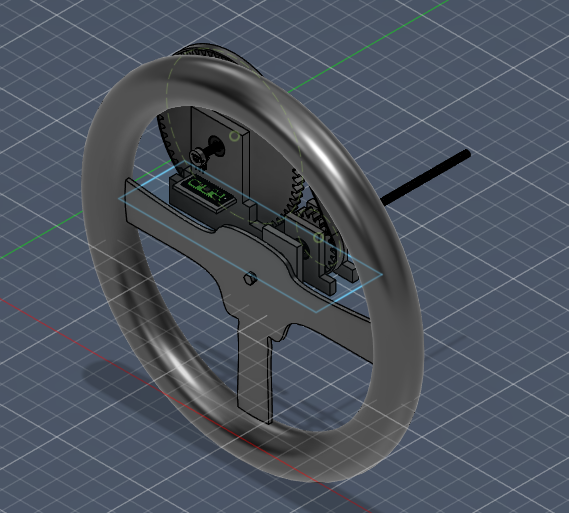

# Spinny Wheel Thing
A very spinning Steering wheel running on rpi pico

## Intro
This is my attempt at making a sim wheel with (sadly) no FFB.

# Steering Assembly & Electronics Bill of Materials

| Name                    | Purpose                                    | Qty | Total (USD) | Distributor                 | Link                                                                                                                           |
|:------------------------|:-------------------------------------------|:----|:------------|:----------------------------|:-------------------------------------------------------------------------------------------------------------------------------|
| **Supports**            | To hold the bolts in place together        | 1   | $10.00      | Hardware Store / 3D Printed | -                                                                                                                              |
| **Gear**                | Gearing down Pot (1:3.1 ratio)             | 1   | $4.00       | 3D Printed                  | -                                                                                                                              |
| **Bolt**                | Connected to steering wheel and gear       | 2   | $9.09       | Hardware Store / 3D Printed | [Link to listing](https://www.mcmaster.com/93325A422/)                                                                         |
| **M2 Screws**           | To mount things                            | 8   | $0.28       | Hardware Store              | [Link to listing](https://www1.mcmaster.com/99461A914/)                                                                        |
| **Washer**              | To ensure easier turning / reduce friction | 4   | $5.71       | Hardware Store / 3D Printed | [Link to listing](https://www.mcmaster.com/91701A622/)                                                                         |
| **Pulley Belt**         | Connecting the 2 gears without backlash    | 1   | $26.43      | Hardware Store              | [Link to listing](https://www1.mcmaster.com/6484K159/)                                                                         |
| **Nut**                 | Stopping steering wheel from over-turning  | 4   | $0.25       | Hardware Store / 3D Printed | [Link to listing](https://www.mcmaster.com/97700A160/)                                                                         |
| **Ball Bearing**        | To ensure smooth turning                   | 5   | $2.00       | Amazon                      | [Link to listing](https://www.amazon.ae/gp/product/B0G1FX4NN2)                                                                 |
| **Wires**               | Connecting components together             | 1   | $5.50       | Besomi                      | [Link to listing](https://besomi.com/ae_en/premium-dupont-wire-kit-for-arduino-and-diy-projects-120pcs-20cm-multicolored.html) |
| **Potentiometer**       | Getting rotation data                      | 1   | $2.00       | Besomi                      | [Link to listing](https://besomi.com/ae_en/potentiometer-b10k.html)                                                            |
| **Raspberry Pi Pico H** | Brains of the operation                    | 1   | $8.50       | Besomi                      | [Link to listing](https://besomi.com/ae_en/raspberry-pi-pico-h.html)                                                           |

**Total Estimated Cost: $47.00**  
_(Price is subject to change (possibly lower), this figure is purely an estimate.)_

# Wiring Diagram

# Project pictures

